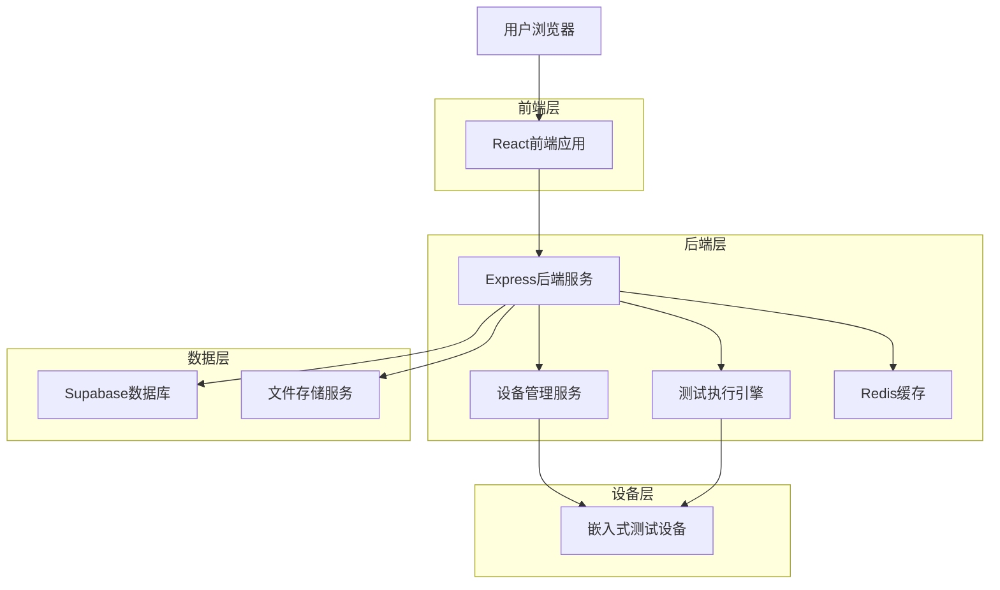
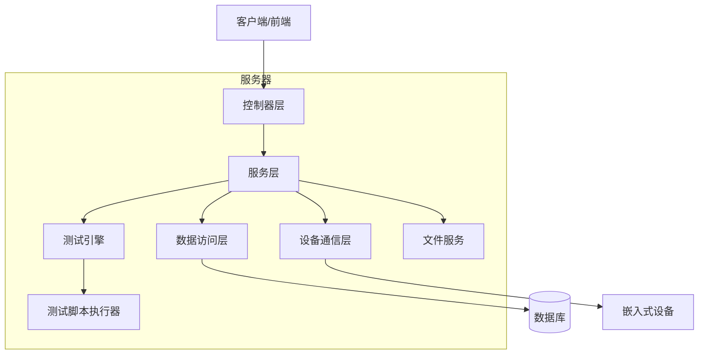
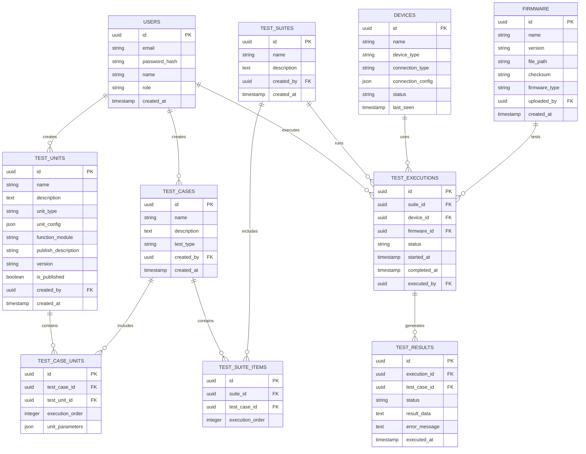

# 嵌入式自动化测试系统 - 技术架构文档

## 1. 架构设计



## 2. 技术描述

* 前端：React\@18 + TypeScript + Ant Design + Vite

* 后端：Express\@4 + TypeScript + Socket.io

* 数据库：Supabase (PostgreSQL)

* 缓存：Redis\@7

* 设备通信：Serial/TCP/UDP协议栈

* 文件存储：Supabase Storage

## 3. 路由定义

| 路由                   | 用途                 |
| -------------------- | ------------------ |
| /dashboard           | 仪表板页面，显示测试概览和设备状态  |
| /test-management     | 测试管理页面，管理测试用例和测试套件 |
| /device-management   | 设备管理页面，管理和监控测试设备   |
| /firmware-management | 固件管理页面，管理固件版本和上传   |
| /test-execution      | 测试执行页面，启动和监控测试任务   |
| /reports             | 报告分析页面，查看测试报告和数据分析 |
| /system-config       | 系统配置页面，用户和系统参数管理   |
| /login               | 登录页面，用户身份验证        |

## 4. API定义

### 4.1 核心API

用户认证相关

```
POST /api/auth/login
```

请求：

| 参数名      | 参数类型   | 是否必需 | 描述   |
| -------- | ------ | ---- | ---- |
| email    | string | true | 用户邮箱 |
| password | string | true | 用户密码 |

响应：

| 参数名     | 参数类型    | 描述      |
| ------- | ------- | ------- |
| success | boolean | 登录是否成功  |
| token   | string  | JWT访问令牌 |
| user    | object  | 用户信息    |

测试单元管理

```
GET /api/test-units
POST /api/test-units
PUT /api/test-units/:id
DELETE /api/test-units/:id
POST /api/test-units/:id/publish
```

测试用例管理

```
GET /api/test-cases
POST /api/test-cases
PUT /api/test-cases/:id
DELETE /api/test-cases/:id
GET /api/test-cases/:id/units
POST /api/test-cases/:id/units
```

设备管理

```
GET /api/devices
POST /api/devices
PUT /api/devices/:id
GET /api/devices/:id/status
```

测试执行

```
POST /api/test-execution/start
GET /api/test-execution/:id/status
POST /api/test-execution/:id/stop
```

固件管理

```
GET /api/firmware
POST /api/firmware/upload
GET /api/firmware/:id/download
```

权限控制

```
GET /api/auth/permissions
POST /api/auth/check-permission
```

### 4.1 测试单元API详细定义

创建测试单元
```
POST /api/test-units
```

请求参数：
| 参数名 | 参数类型 | 是否必需 | 描述 |
|--------|----------|----------|------|
| name | string | true | 测试单元名称 |
| description | string | false | 测试单元描述 |
| unit_type | string | true | 单元类型：command_send, current_measure, wait, initialize, finalize |
| unit_config | object | true | 单元配置参数 |
| function_module | string | false | 功能模块：system, multimedia, low_power |

响应：
| 参数名 | 参数类型 | 描述 |
|--------|----------|------|
| success | boolean | 创建是否成功 |
| unit_id | string | 测试单元ID |

发布测试单元
```
POST /api/test-units/:id/publish
```

请求参数：
| 参数名 | 参数类型 | 是否必需 | 描述 |
|--------|----------|----------|------|
| function_module | string | true | 所属功能模块 |
| publish_description | string | true | 发布说明 |

响应：
| 参数名 | 参数类型 | 描述 |
|--------|----------|------|
| success | boolean | 发布是否成功 |
| version | string | 发布版本号 |

### 4.2 API权限控制说明

根据PRD中定义的用户角色权限，各API的访问控制如下：

| API端点 | 测试工程师 | 开发工程师 | 项目经理 | 系统管理员 |
|---------|-----------|-----------|----------|------------|
| GET /api/devices | ✓ | ✓ | ✓ | ✓ |
| POST /api/devices | ✓ | ✗ | ✓ | ✓ |
| PUT /api/devices/:id | ✓ | ✗ | ✓ | ✓ |
| POST /api/firmware/upload (functional_test) | ✗ | ✓ | ✓ | ✓ |
| POST /api/firmware/upload (pre_release) | ✓ | ✗ | ✓ | ✓ |
| GET /api/firmware | ✓ | ✓ | ✓ | ✓ |
| POST /api/test-units | ✓ | ✓ | ✓ | ✓ |
| POST /api/test-units/:id/publish | ✓ | ✓ | ✓ | ✓ |
| POST /api/test-cases | ✓ | ✓ | ✓ | ✓ |
| POST /api/test-execution/start | ✓ | ✓ | ✓ | ✓ |
| GET /api/reports | ✓ | ✓ | ✓ | ✓ |
| POST /api/users | ✗ | ✗ | ✓ | ✓ |
| PUT /api/system-config | ✗ | ✗ | ✗ | ✓ |

**权限说明：**
- **测试工程师**：管理和维护测试设备，获取预发布固件，创建和执行测试集，管理测试报告
- **开发工程师**：上传功能点测试固件，创建和执行测试集，查看测试报告
- **项目经理**：在开发工程师权限基础上增加：上传预发布固件，查看项目测试概览，管理团队成员
- **系统管理员**：管理所有用户，配置系统参数

## 5. 服务器架构图



## 6. 数据模型

### 6.1 数据模型定义



### 6.2 数据定义语言

用户表 (users)

```sql
-- 创建用户表
CREATE TABLE users (
    id UUID PRIMARY KEY DEFAULT gen_random_uuid(),
    email VARCHAR(255) UNIQUE NOT NULL,
    password_hash VARCHAR(255) NOT NULL,
    name VARCHAR(100) NOT NULL,
    role VARCHAR(20) DEFAULT 'test_engineer' CHECK (role IN ('test_engineer', 'developer', 'project_manager', 'admin')),
    created_at TIMESTAMP WITH TIME ZONE DEFAULT NOW(),
    updated_at TIMESTAMP WITH TIME ZONE DEFAULT NOW()
);

-- 创建索引
CREATE INDEX idx_users_email ON users(email);
CREATE INDEX idx_users_role ON users(role);

-- 权限设置
GRANT SELECT ON users TO anon;
GRANT ALL PRIVILEGES ON users TO authenticated;
```

测试用例表 (test\_cases)

```sql
-- 创建测试单元表
CREATE TABLE test_units (
    id UUID PRIMARY KEY DEFAULT gen_random_uuid(),
    name VARCHAR(255) NOT NULL,
    description TEXT,
    unit_type VARCHAR(50) NOT NULL CHECK (unit_type IN ('command_send', 'current_measure', 'wait', 'initialize', 'finalize')),
    unit_config JSONB NOT NULL,
    function_module VARCHAR(50) CHECK (function_module IN ('system', 'multimedia', 'low_power')),
    publish_description TEXT,
    version VARCHAR(20) DEFAULT 'v1',
    is_published BOOLEAN DEFAULT FALSE,
    created_by UUID REFERENCES users(id),
    created_at TIMESTAMP WITH TIME ZONE DEFAULT NOW(),
    updated_at TIMESTAMP WITH TIME ZONE DEFAULT NOW()
);

-- 创建测试用例表
CREATE TABLE test_cases (
    id UUID PRIMARY KEY DEFAULT gen_random_uuid(),
    name VARCHAR(255) NOT NULL,
    description TEXT,
    test_type VARCHAR(50) NOT NULL CHECK (test_type IN ('functional', 'performance', 'stability')),
    created_by UUID REFERENCES users(id),
    created_at TIMESTAMP WITH TIME ZONE DEFAULT NOW(),
    updated_at TIMESTAMP WITH TIME ZONE DEFAULT NOW()
);

-- 创建测试用例单元关联表
CREATE TABLE test_case_units (
    id UUID PRIMARY KEY DEFAULT gen_random_uuid(),
    test_case_id UUID REFERENCES test_cases(id) ON DELETE CASCADE,
    test_unit_id UUID REFERENCES test_units(id) ON DELETE CASCADE,
    execution_order INTEGER NOT NULL DEFAULT 0,
    unit_parameters JSONB,
    created_at TIMESTAMP WITH TIME ZONE DEFAULT NOW()
);

-- 创建测试单元索引
CREATE INDEX idx_test_units_created_by ON test_units(created_by);
CREATE INDEX idx_test_units_unit_type ON test_units(unit_type);
CREATE INDEX idx_test_units_is_published ON test_units(is_published);
CREATE INDEX idx_test_units_function_module ON test_units(function_module);

-- 创建测试用例索引
CREATE INDEX idx_test_cases_created_by ON test_cases(created_by);
CREATE INDEX idx_test_cases_test_type ON test_cases(test_type);

-- 创建测试用例单元关联索引
CREATE INDEX idx_test_case_units_test_case_id ON test_case_units(test_case_id);
CREATE INDEX idx_test_case_units_test_unit_id ON test_case_units(test_unit_id);
CREATE INDEX idx_test_case_units_execution_order ON test_case_units(test_case_id, execution_order);

-- 测试单元权限设置
GRANT SELECT ON test_units TO anon;
GRANT ALL PRIVILEGES ON test_units TO authenticated;

-- 测试用例权限设置
GRANT SELECT ON test_cases TO anon;
GRANT ALL PRIVILEGES ON test_cases TO authenticated;

-- 测试用例单元关联权限设置
GRANT SELECT ON test_case_units TO anon;
GRANT ALL PRIVILEGES ON test_case_units TO authenticated;
```

设备表 (devices)

```sql
-- 创建设备表
CREATE TABLE devices (
    id UUID PRIMARY KEY DEFAULT gen_random_uuid(),
    name VARCHAR(255) NOT NULL,
    device_type VARCHAR(100) NOT NULL,
    connection_type VARCHAR(50) NOT NULL CHECK (connection_type IN ('serial', 'tcp', 'udp', 'usb')),
    connection_config JSONB NOT NULL,
    status VARCHAR(20) DEFAULT 'offline' CHECK (status IN ('online', 'offline', 'busy', 'error')),
    last_seen TIMESTAMP WITH TIME ZONE,
    created_at TIMESTAMP WITH TIME ZONE DEFAULT NOW()
);

-- 创建固件表
CREATE TABLE firmware (
    id UUID PRIMARY KEY DEFAULT gen_random_uuid(),
    name VARCHAR(255) NOT NULL,
    version VARCHAR(100) NOT NULL,
    file_path VARCHAR(500) NOT NULL,
    checksum VARCHAR(64) NOT NULL,
    firmware_type VARCHAR(20) NOT NULL CHECK (firmware_type IN ('functional_test', 'pre_release')),
    uploaded_by UUID REFERENCES users(id),
    created_at TIMESTAMP WITH TIME ZONE DEFAULT NOW(),
    updated_at TIMESTAMP WITH TIME ZONE DEFAULT NOW()
);

-- 创建索引
CREATE INDEX idx_devices_status ON devices(status);
CREATE INDEX idx_devices_device_type ON devices(device_type);

-- 权限设置
GRANT SELECT ON devices TO anon;
GRANT ALL PRIVILEGES ON devices TO authenticated;
```

固件表 (firmware)

```sql
-- 创建索引
CREATE INDEX idx_firmware_uploaded_by ON firmware(uploaded_by);
CREATE INDEX idx_firmware_firmware_type ON firmware(firmware_type);
CREATE INDEX idx_firmware_version ON firmware(version);

-- 权限设置
GRANT SELECT ON firmware TO anon;
GRANT ALL PRIVILEGES ON firmware TO authenticated;
```

测试套件表 (test_suites)

```sql
-- 创建测试套件表
CREATE TABLE test_suites (
    id UUID PRIMARY KEY DEFAULT gen_random_uuid(),
    name VARCHAR(255) NOT NULL,
    description TEXT,
    created_by UUID REFERENCES users(id),
    created_at TIMESTAMP WITH TIME ZONE DEFAULT NOW(),
    updated_at TIMESTAMP WITH TIME ZONE DEFAULT NOW()
);

-- 创建索引
CREATE INDEX idx_test_suites_created_by ON test_suites(created_by);

-- 权限设置
GRANT SELECT ON test_suites TO anon;
GRANT ALL PRIVILEGES ON test_suites TO authenticated;
```

测试套件项表 (test_suite_items)

```sql
-- 创建测试套件项表
CREATE TABLE test_suite_items (
    id UUID PRIMARY KEY DEFAULT gen_random_uuid(),
    suite_id UUID REFERENCES test_suites(id) ON DELETE CASCADE,
    test_case_id UUID REFERENCES test_cases(id) ON DELETE CASCADE,
    execution_order INTEGER NOT NULL DEFAULT 0,
    created_at TIMESTAMP WITH TIME ZONE DEFAULT NOW()
);

-- 创建索引
CREATE INDEX idx_test_suite_items_suite_id ON test_suite_items(suite_id);
CREATE INDEX idx_test_suite_items_test_case_id ON test_suite_items(test_case_id);

-- 权限设置
GRANT SELECT ON test_suite_items TO anon;
GRANT ALL PRIVILEGES ON test_suite_items TO authenticated;
```

测试结果表 (test_results)

```sql
-- 创建测试结果表
CREATE TABLE test_results (
    id UUID PRIMARY KEY DEFAULT gen_random_uuid(),
    execution_id UUID REFERENCES test_executions(id) ON DELETE CASCADE,
    test_case_id UUID REFERENCES test_cases(id),
    status VARCHAR(20) NOT NULL CHECK (status IN ('passed', 'failed', 'skipped', 'error')),
    result_data JSONB,
    error_message TEXT,
    executed_at TIMESTAMP WITH TIME ZONE DEFAULT NOW()
);

-- 创建索引
CREATE INDEX idx_test_results_execution_id ON test_results(execution_id);
CREATE INDEX idx_test_results_test_case_id ON test_results(test_case_id);
CREATE INDEX idx_test_results_status ON test_results(status);

-- 权限设置
GRANT SELECT ON test_results TO anon;
GRANT ALL PRIVILEGES ON test_results TO authenticated;

测试执行表 (test\_executions)

```sql
-- 创建测试执行表
CREATE TABLE test_executions (
    id UUID PRIMARY KEY DEFAULT gen_random_uuid(),
    suite_id UUID REFERENCES test_suites(id),
    device_id UUID REFERENCES devices(id),
    firmware_id UUID REFERENCES firmware(id),
    status VARCHAR(20) DEFAULT 'pending' CHECK (status IN ('pending', 'running', 'completed', 'failed', 'cancelled')),
    started_at TIMESTAMP WITH TIME ZONE,
    completed_at TIMESTAMP WITH TIME ZONE,
    executed_by UUID REFERENCES users(id),
    created_at TIMESTAMP WITH TIME ZONE DEFAULT NOW()
);

-- 创建索引
CREATE INDEX idx_test_executions_status ON test_executions(status);
CREATE INDEX idx_test_executions_device_id ON test_executions(device_id);
CREATE INDEX idx_test_executions_started_at ON test_executions(started_at DESC);

-- 权限设置
GRANT SELECT ON test_executions TO anon;
GRANT ALL PRIVILEGES ON test_executions TO authenticated;
```

-- 初始化数据

```sql
-- 插入默认管理员用户
INSERT INTO users (email, password_hash, name, role) VALUES 
('admin@example.com', '$2b$10$example_hash', '系统管理员', 'admin'),
('test@example.com', '$2b$10$example_hash', '测试工程师', 'test_engineer'),
('dev@example.com', '$2b$10$example_hash', '开发工程师', 'developer'),
('pm@example.com', '$2b$10$example_hash', '项目经理', 'project_manager');

-- 插入示例测试单元
INSERT INTO test_units (name, description, unit_type, unit_config, function_module, publish_description, is_published, created_by) VALUES 
('GPIO初始化', '初始化GPIO引脚配置', 'initialize', '{"pins": ["PA0", "PA1"], "mode": "output"}', 'system', '系统GPIO初始化单元', true, (SELECT id FROM users WHERE role = 'admin' LIMIT 1)),
('发送AT命令', '向设备发送AT指令', 'command_send', '{"command": "AT+VERSION", "timeout": 5000}', 'system', '通用AT命令发送单元', true, (SELECT id FROM users WHERE role = 'test_engineer' LIMIT 1)),
('电流测量', '测量设备当前电流', 'current_measure', '{"duration": 1000, "threshold": 100}', 'low_power', '低功耗电流测量单元', true, (SELECT id FROM users WHERE role = 'test_engineer' LIMIT 1)),
('等待延时', '测试单元间的等待延时', 'wait', '{"duration": 2000}', null, null, false, (SELECT id FROM users WHERE role = 'admin' LIMIT 1)),
('测试结束', '收集测试结果并清理', 'finalize', '{"collect_logs": true, "cleanup": true}', 'system', '通用测试结束单元', true, (SELECT id FROM users WHERE role = 'admin' LIMIT 1));

-- 插入示例测试用例
INSERT INTO test_cases (name, description, test_type, created_by) VALUES 
('GPIO功能测试', '测试GPIO引脚的输入输出功能', 'functional', (SELECT id FROM users WHERE role = 'admin' LIMIT 1)),
('串口通信测试', '测试串口通信功能', 'functional', (SELECT id FROM users WHERE role = 'test_engineer' LIMIT 1)),
('低功耗模式测试', '测试设备低功耗模式下的电流消耗', 'performance', (SELECT id FROM users WHERE role = 'test_engineer' LIMIT 1));

-- 插入测试用例单元关联
INSERT INTO test_case_units (test_case_id, test_unit_id, execution_order, unit_parameters) VALUES 
-- GPIO功能测试用例
((SELECT id FROM test_cases WHERE name = 'GPIO功能测试'), (SELECT id FROM test_units WHERE name = 'GPIO初始化'), 1, '{"custom_pins": ["PA2", "PA3"]}'),
((SELECT id FROM test_cases WHERE name = 'GPIO功能测试'), (SELECT id FROM test_units WHERE name = '等待延时'), 2, '{"duration": 1000}'),
((SELECT id FROM test_cases WHERE name = 'GPIO功能测试'), (SELECT id FROM test_units WHERE name = '测试结束'), 3, '{}'),
-- 串口通信测试用例
((SELECT id FROM test_cases WHERE name = '串口通信测试'), (SELECT id FROM test_units WHERE name = 'GPIO初始化'), 1, '{}'),
((SELECT id FROM test_cases WHERE name = '串口通信测试'), (SELECT id FROM test_units WHERE name = '发送AT命令'), 2, '{"command": "AT+UART_TEST"}'),
((SELECT id FROM test_cases WHERE name = '串口通信测试'), (SELECT id FROM test_units WHERE name = '测试结束'), 3, '{}'),
-- 低功耗模式测试用例
((SELECT id FROM test_cases WHERE name = '低功耗模式测试'), (SELECT id FROM test_units WHERE name = 'GPIO初始化'), 1, '{}'),
((SELECT id FROM test_cases WHERE name = '低功耗模式测试'), (SELECT id FROM test_units WHERE name = '发送AT命令'), 2, '{"command": "AT+SLEEP"}'),
((SELECT id FROM test_cases WHERE name = '低功耗模式测试'), (SELECT id FROM test_units WHERE name = '等待延时'), 3, '{"duration": 5000}'),
((SELECT id FROM test_cases WHERE name = '低功耗模式测试'), (SELECT id FROM test_units WHERE name = '电流测量'), 4, '{"duration": 10000, "threshold": 50}'),
((SELECT id FROM test_cases WHERE name = '低功耗模式测试'), (SELECT id FROM test_units WHERE name = '测试结束'), 5, '{}');

-- 插入示例固件
INSERT INTO firmware (name, version, file_path, checksum, firmware_type, uploaded_by) VALUES 
('功能测试固件v1.0', '1.0.0', '/uploads/firmware/functional_v1.0.bin', 'abc123def456', 'functional_test', (SELECT id FROM users WHERE role = 'developer' LIMIT 1)),
('预发布固件v2.0', '2.0.0', '/uploads/firmware/prerelease_v2.0.bin', 'def456ghi789', 'pre_release', (SELECT id FROM users WHERE role = 'project_manager' LIMIT 1));

-- 插入示例设备
INSERT INTO devices (name, device_type, connection_type, connection_config, status) VALUES 
('开发板A', 'STM32F4', 'serial', '{"port": "/dev/ttyUSB0", "baudrate": 115200}', 'online'),
('测试设备B', 'ESP32', 'tcp', '{"host": "192.168.1.100", "port": 8080}', 'offline');
```

