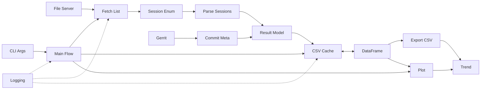

# 低功耗 & 大模型 协同实践分享

三个案例 · 两个观点 · 一个建议

按空格开始 · Space to Start

---
layout: image-right

image: /logo.png
---

  <h1 class="mb-6">目录</h1>
  <ol class="list-decimal list-inside space-y-3 text-left text-lg leading-relaxed">
    <li>案例一：低功耗数据可视化脚本</li>
    <li>观点一：把大模型当“人”看待</li>
    <li>主流大模型主观体验速览</li>
    <li>案例二：低功耗测试系统极速开发</li>
    <li>观点二：需求思维 vs 实现思维</li>
    <li>团队建议：成立 AI 技术部门</li>
    <li>自由讨论：数据安全</li>
    <li>案例三：Armino 代码优化案例</li>
  </ol>

<!-- <Toc minDepth="1" maxDepth="1" class="mt-6 text-sm" /> -->

---
layout: center
---

## 案例一 · 案例展示

从现有 IT-Verify 系统中获取电流测试（点击查看原图）

  

    <figure class="m-0">
      
      <figcaption class="text-xs opacity-65 mt-1 text-center">A1</figcaption>
    </figure>
    <figure class="m-0">
      
      <figcaption class="text-xs opacity-65 mt-1 text-center">A2</figcaption>
    </figure>
  

  <figure class="m-0 mt-6">
    
    <figcaption class="text-xs opacity-65 mt-1 text-center">A3</figcaption>
  </figure>

---
layout: center
---

## 案例一 · 案例展示

近期脚本运行产出示例（点击查看原图）

  <figure class="text-center">
    
    <figcaption class="text-xs mt-1 opacity-70">7236 近期电流监控</figcaption>
  </figure>
  <figure class="text-center">
    
    <figcaption class="text-xs mt-1 opacity-70">7239 近期电流监控</figcaption>
  </figure>
  <figure class="text-center">
    
    <figcaption class="text-xs mt-1 opacity-70">CSV 格式的数据缓存</figcaption>
  </figure>
  <figure class="text-center">
    
    <figcaption class="text-xs mt-1 opacity-70">脚本命令</figcaption>
  </figure>
  <figure class="text-center">
    
    <figcaption class="text-xs mt-1 opacity-70">输出的 SVG 图表</figcaption>
  </figure>
  <figure class="text-center">
    
    <figcaption class="text-xs mt-1 opacity-70">输出的单次查询汇总表格</figcaption>
  </figure>

* 缩略图尺寸裁剪显示，点击查看原始清晰度 *

---
layout: default
---

# 案例一 · 低功耗数据可视化脚本

目标：每天自动汇总低功耗测试结果 → 一图（表）掌握分支表现

引入 Trae 之前（shell 脚本）：
- 解析易出错，健壮性差
- 维护成本高，扩展困难
- 无统一可视化 & 汇总
- 不到 200 行的代码量

引入 Trae 之后（Python + 拆解 + 可视化）：
- 按功能拆分：下载 / 解析 / 清洗 / 聚合 / 展示 / 存储
- 增加异常兜底 & 日志
- 结果统一结构化输出
- 超过 1200 行代码

> 总结：Trae 在提升效率的同时也提升了我们的能力上限，使得原本无法完成/难以完成的任务变得可行
> 
> 潜在问题：如何对 Trae 生成的代码进行高效维护

---
layout: center
---

## 案例一 · 案例展示

> 获取脚本：http://192.168.0.6/zhuo.xu/power_lab/-/blob/main/main.py 
> 
> https://gitlab.bekencorp.com/wifi/power-lab/-/blob/main/main.py

关键设计：
- 解耦：模块函数化 & 可单测
- 鲁棒：解析前格式探测 / 异常捕获
- 可维护：配置驱动（目录 / 指标 / 阈值）

系统架构：

---
layout: two-cols-header
---

# 观点一 · 把大模型当“人”看待
不同的大模型就像不同的人，能力、风格和沟通方式各异

::left::

避坑：

- 不要使用“玩具模型”；

- 尽量不要使用“auto模式”；

建议这么做：

- 关注最新的大模型，使用更新更强的模型；

- 针对不同的任务，使用不同的模型；

- 亲自认识不同的大模型，找到适合你的模型；

> TIPS: 在内网引进更强大的模型之前，非常建议自行在外网环境安装trae国际版尝鲜（或者cursor、copilot、augment。。。）

::right::

  <figure class="flex flex-col items-end">
    
    <figcaption class="text-xs opacity-70 mt-1">Trae CN</figcaption>
  </figure>
  <figure class="flex flex-col items-end">
    
    <figcaption class="text-xs opacity-70 mt-1">Trae 国际版</figcaption>
  </figure>
  <figure class="flex flex-col items-end">
    
    <figcaption class="text-xs opacity-70 mt-1">Copilot</figcaption>
  </figure>
  <figure class="flex flex-col items-end">
    
    <figcaption class="text-xs opacity-70 mt-1">Cursor</figcaption>
  </figure>

---
layout: center
---

## 主流大模型主观体验

| 模型 | 主观定位 | 优势 | 局限 / 备注 |
| ---- | -------- | ---- | ------------- |
| ChatGPT 4/5 | 全能通用 | 语言与综合 | 复杂系统架构深度一般 |
| Kimi K2 | 国产编程 | 脚本 / 小系统 | 大型架构规划稍弱 |
| Qwen Code | 代码生成 | 传闻比Kimi强 | 个人体验没Kimi强 |
| Claude Sonnet 3.7/4 | 编程中坚 | 稳定产出轻量应用 | 需精确提示结构 |
| Gemini 2.5 | 平衡型 | 多模态 / 推理 | 偶有风格漂移 |
| DeepSeek | 性价比 | 推理链清晰 | 复杂整合能力略逊 |
| 豆包 | 生活助手 | 休闲对话 | 工作技术不推荐 |

> 建议：多试，多记录，多比较。优先和“聊得来”的模型深耕。

---
layout: two-cols-header
---

# 案例二 · 低功耗测试系统极速开发

Trae SOLO 黑客松 极限 4 小时：不写一行代码 / 不熟悉技术栈，生成的系统可用，可直接部署。

::left::

项目演示：https://solo.yooll.ltd

项目级模型的关键要点：
1. 选用 claude sonnet 4 以上的高阶模型；
2. 先从 <a href="/PRD.txt" target="_blank" rel="noopener">产品需求文档 PRD</a> 开始；
3. 小项目可以一把梭生成，大项目建议逐个模块生成；
4. 持续地迭代优化，我的优化过程耗时约6小时；

出现“鬼打墙”时，你可以：

- 尝试删除引起问题的文件；
- 回滚到历史状态并重试；
- 删掉所有项目文件重新开始；

> 强烈建议用 git 管理代码，以防大模型对话回滚失败；

::right::

<figure class="flex flex-col items-end">
  
  <figcaption class="text-xs opacity-70 mt-1">Trae 对话记录</figcaption>
</figure>

---

# 观点二 · 需求思维 vs 实现思维

| 维度 | 实现思维 | 需求思维 |
| ---- | -------- | -------- |
| 起点 | 我会不会做 | 我到底要什么结果 |
| 关注 | 技术细节 / 方案可行 | 场景 / 边界 / 验收标准 |
| 限制 | 被个人知识天花板卡住 | 借力模型补齐未知 |
| 输出 | 代码块 / 零散片段 | 结构化产物 / 可验收交付 |

转变方法：
- 先写：目标 → 场景 → 输入 → 输出 → 约束 → 验收
- 再问：请生成 X（遵循上述框架）
- 复盘：模型产物差在哪 → 更新需求模板

---
layout: statement
---

# 建议成立 AI 技术部门
帮助公司抓住 AI 生产力红利窗口期

---
layout: center
---

## 建议 · AI 技术部门

主要职责：

- 构建和维护公司内网的大模型生态，管理大模型资产和公共资源；

- 承接公司内部效率工具开发需求，充分发挥大模型在工具脚本和web应用开发方面的优势；

- 持续调研大模型应用技术，开展内部技术培训；

> 当前公司在AI大模型领域的人力和资金投入明显不足，未来竞争风险不容忽视。

---
layout: statement
---

# 讨论 · 网络与数据安全
尤其与大模型能力与安全边界相关的问题

---
layout: default
---

# 案例三 · Armino 开发
.23 服务器本周上线，打通了 Trae 和 build server 的最后一公里

大模型在开发大型项目时的局限性

- “吞不下”那么多的代码，容易模型超时
- 容易修改不全，容易产生幻觉开始乱改

可以尝试的做法：

- 指定文件和目录进行分析
- 将相关的文件单独放在一个新的工作区中进行分析（在进行模块重构时很好使）
- 编写项目 rules（都说好使，但我还没研究明白）
- 在外网访问 github 上的 bk_idk 仓库，然后用更高级的模型

> 向 ACL 的先行者们多多请教 Armino 开发上面的使用技巧，多多分享一些关于 rules 和 mcp 的经验；

---

# 案例三 · Armino 开发
阅读和分析代码，提重构建议

  

    
    
Ask: 请阅读并分析项目代码，给出代码优化意见

    
  

  

    
  
Ask: 请从代码重构角度给出一些建议  

    
  

  

    
    
Ask: 请在项目根目录创建目录实现重构并评估资源占用

    
  

--- 

# 案例三 · Armino 开发
生成 commit 信息，生成说明文档

  <figure class="flex flex-col">
    
    <figcaption class="text-xs opacity-65 mt-2 text-center">Commit 信息自动生成（点击放大查看原图）</figcaption>
  </figure>
  <figure class="flex flex-col">
    
    <figcaption class="text-xs opacity-65 mt-2 text-center">重构说明文档生成（点击放大查看原图）</figcaption>
  </figure>

> 除了一键生成 commit 信息按钮之外，还可以将修改打成 patch 然后让 Trae 阅读

---
layout: default
# class: text-center
---

# 总结

三个案例
- 生成脚本：结构化拆解 + 双模型协作
- 生成项目：PRD 文档驱动 + 小步运行
- 辅助编程：限制上下文

两个观点
- 模型当“人”用，建立配合方式
- 需求思维胜于实现执念

一个建议
- 现在就布局内部 AI 生态

---
layout: end
---
感谢聆听，欢迎交流